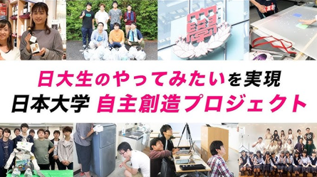

# はじめに

::: info
メタ創は 2026 年度から新体制に移行します
:::

---

# メタ創とは

『N.U.メタバースの可能性を創造しよう！』（略：メタ創）は、日本大学の理工学部・工学部・芸術学部の学部生で構成される、
2025 年 4 月に発足した、顧問を置かず学生だけで自由に創作活動を行う、大学本部直轄のプロジェクト団体です。

プロジェクトというのは、『日大生のやってみたいを実現するプロジェクト』という制度を用いた学生団体のことです。
文化の発展 or 日本大学の発展 or SDGs いずれかに寄与するやってみたいことを日本大学から 1 年間手厚いご支援をしていただけるという制度となっており、毎年 20 ～ 40 団体がこちらの制度を活用して日本大学から学生団体が立ち上がっています。

---

# メタ創の活動内容

メタ創は、メタバース・デジタル分野の創作に特化した団体です。

主な活動分野は以下のようなものがあります。

- モデリング (3D モデリング、キャラクターモデリングなど)

- プログラミング (ゲーム開発、Web 開発、アプリ開発など)

- デザイン (UI/UX デザイン、デジタルイラスト、ポスターなど)

- サウンド (音楽制作、効果音制作など)

- 映像制作 (動画編集など)

これらの技術を活かし、メンバーそれぞれが主体的に制作活動を行っています。

---

# このドキュメントについて

一口に「デジタル創作」といっても、その分野は多岐にわたります。
デザイン、サウンド、プログラミング、3D モデリング、映像制作 など
本ドキュメントでは、これらの分野について
基礎的な知識やツールの使い方を紹介し、活動を始めるきっかけを提供することを目的としています。

「何から始めればいいかわからない」「興味はあるけど一歩踏み出せない」
そんな人が、メタ創での活動をイメージできるような内容を目指しています。
