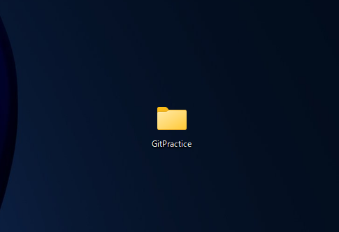
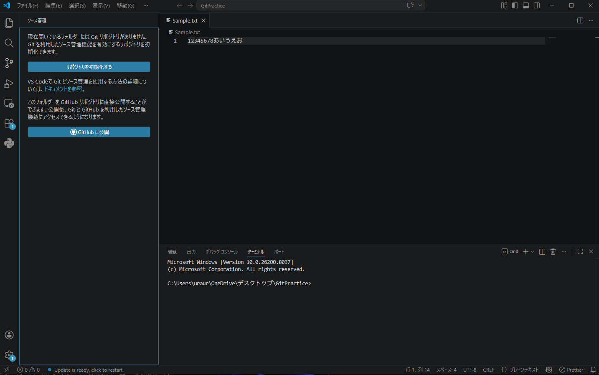
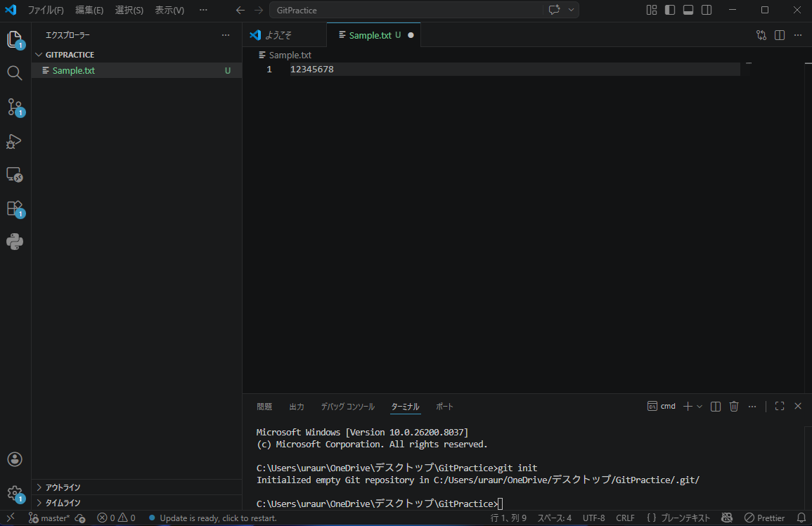
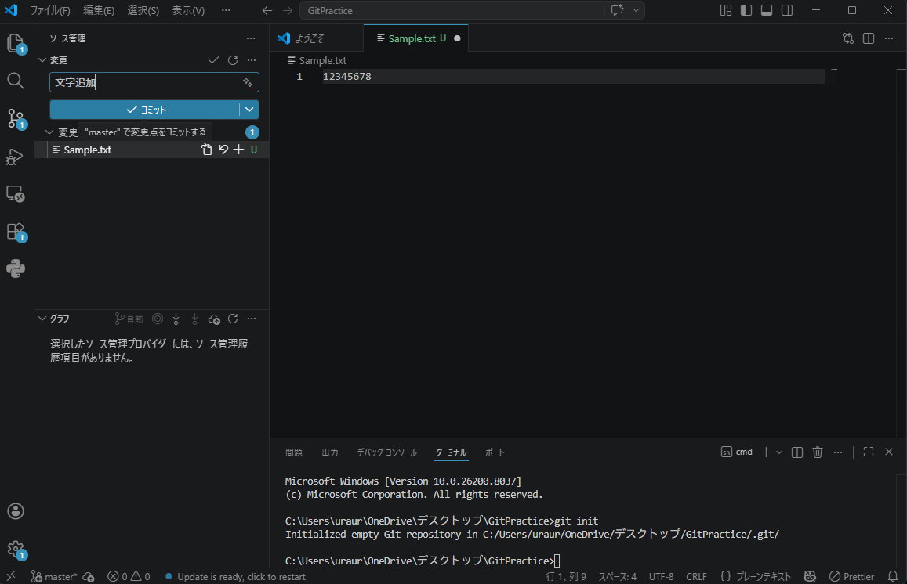
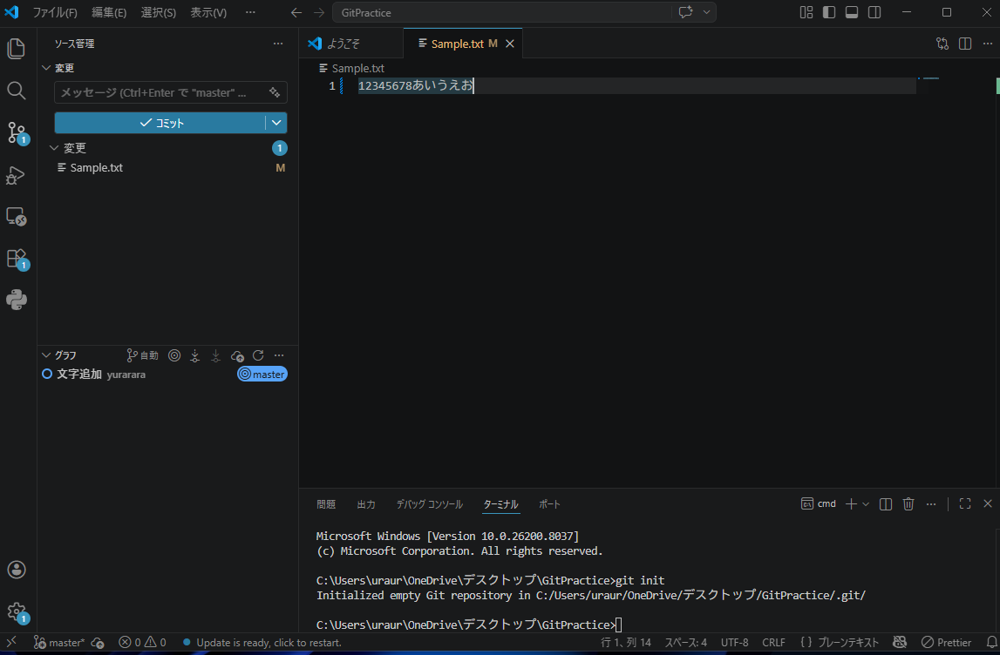
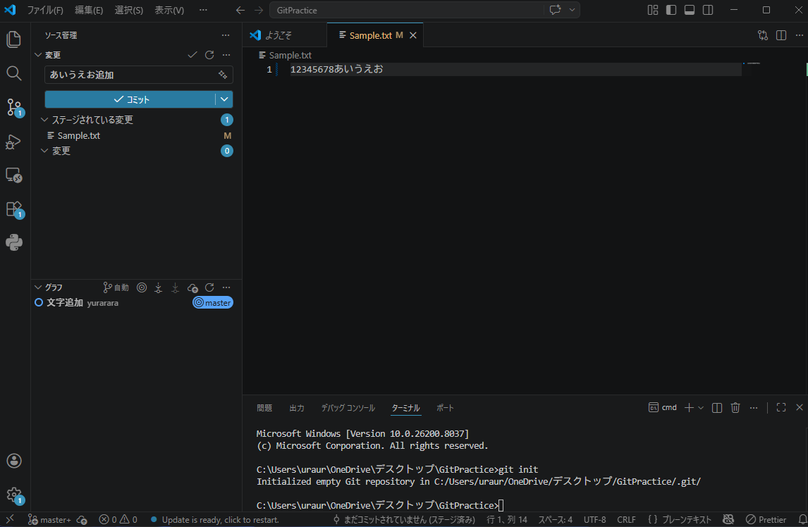
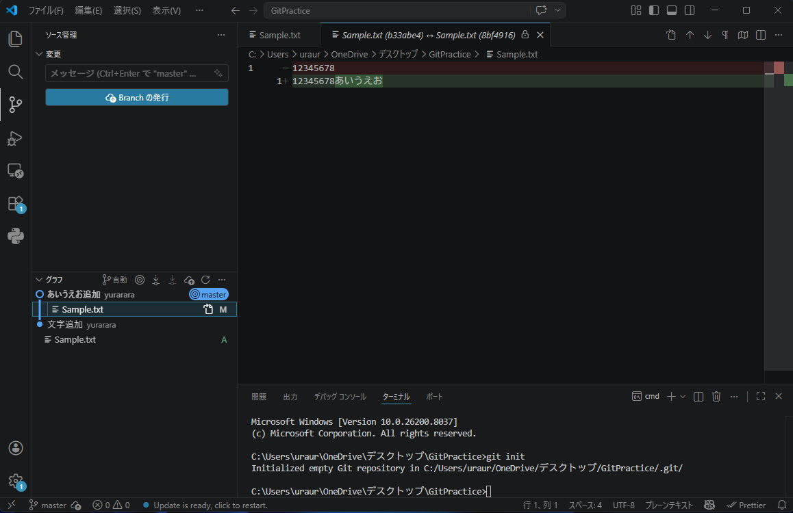

# Git

## 1. Git とは？

- **バージョン管理システム**の一つです。
- ソースコードなどの「いつ」「誰が」「どこを」「どうやって」変更したかという変更履歴を記録・追跡できます。
- 過去の状態に戻したり、複数人で同時に開発したりする際に必須となるツールです。

---

## 2. よく出てくる用語解説

| 用語                         | 意味                                                                                     |
| :--------------------------- | :--------------------------------------------------------------------------------------- |
| **リポジトリ（Repository）** | プロジェクトのフォルダ。Gitで変更履歴が管理される単位。                                  |
| **ローカルリポジトリ**       | 自分のPC上にあるリポジトリ。まずはここで作業を行う。                                     |
| **リモートリポジトリ**       | GitHubなど、インターネットのサーバー上にあるリポジトリ。                                 |
| **clone（クローン）**        | リモートリポジトリを自分のPC（ローカル）に丸ごとコピーしてくること。                     |
| **commit（コミット）**       | 変更した内容にメッセージをつけて、ローカルリポジトリに保存する操作。                     |
| **push（プッシュ）**         | ローカルで行ったコミットを、リモートリポジトリに送信して反映させる操作。                 |
| **pull（プル）**             | リモートリポジトリにある最新の変更を、自分のローカルリポジトリに取り込む操作。           |
| **branch（ブランチ）**       | 開発の枝分かれ。作業を並行して進めるための機能。基本となる main ブランチが必ず存在する。 |
| **merge（マージ）**          | 他のブランチで行った変更を、別のブランチに合流させて取り込むこと。                       |

---

## 3. Commitについて

コミットはゲームのセーブのようなものですが、後で自分や他人が読み返すための記録という側面が強いです。

### Commitの粒度

正解はありませんが、あとで振り返りやすい・扱いやすい単位にするのが理想です。

> **参考記事**
>
> - [【初心者向け】「コミットの粒度がわからない問題」の模範解答を考えてみた](https://qiita.com/jnchito/items/40e0c7d32fde352607be)
> - [あなたの Pull Request は汚いかもしれない](https://zenn.dev/tkydev/articles/4286cb9691dd6b)

---

## 4. Branchについて

ブランチは、作業の切り替えや安全性の確保に役立ちます。

**ブランチを使うメリット**

1. **メイン（本番用）に干渉しない**
   - 実験や試作をしてコードが動かなくなっても、main ブランチに戻れば問題ない。
2. **作業の中断・切り替えが楽**
   - 新機能Aを作っている最中にバグ修正が必要になった場合でも、ブランチを切り替えれば、中途半端な作業を汚さずにすぐバグ修正に取り掛かれます。

> **参考記事**
>
> - [Gitのブランチって何？作成と切り替えをまずは覚えてみよう！【Git】](https://tamotech.blog/2025/05/26/git-branch/)

### ブランチ名の使い分け例

命名規則を決めておくと、後から見返した時に何の作業をしているブランチか一目でわかります。

| ブランチ名      | 役割           | 使うタイミング・例                                                           |
| :-------------- | :------------- | :--------------------------------------------------------------------------- |
| **main**        | 本番用・完成版 | 常にリリースできる（正常に動く）状態のものだけを置く。                       |
| **feature/xxx** | 新機能の開発   | 「新しいページを作る」「デザインを変える」など（例: `feature/login-page`）。 |
| **fix/xxx**     | バグ修正       | 「ボタンが効かない」「文字化け」などを直す（例: `fix/button-bug`）。         |
| **try/xxx**     | 実験・検証     | 「このライブラリを試してみたい」といった壊れるかもしれない作業。             |

---

## 5. 基本的なワークフロー

1. **作業開始**: main から新しくブランチを作成して移動する（例: `feature/todo-list`）。
2. **作業中**: コードを書き、キリの良いところで細かくコミットする。
3. **整理**: プッシュする前に、細かいタイポ修正などの無駄なコミット履歴があれば一つにまとめる。
4. **プッシュ**: 変更をリモートリポジトリへ送信する。
5. **合流**: レビュー後、完成したコードを main ブランチにマージする。

---

## 6. Git の導入と初期設定

### 6-1. Git のインストール

[Git公式サイト (https://git-scm.com/)](https://git-scm.com/) からOSに合わせたインストーラーをダウンロードし、インストールします。

> **Tips**
>
> - インストーラの選択肢は基本的にすべて「Next」のままで大丈夫です。
> - Windowsの場合、設定の「アプリ（ストレージ）」からアンインストールすれば、また1からクリーンインストールし直せます。

### 6-2. Git の初期設定（ターミナルで実行）

インストール後、誰がコミットしたかを記録するための初期設定を行います。

```bash
# コミット履歴に残る名前の設定
git config --global user.name "あなたの名前"

# コミット履歴に残るメールアドレスの設定
git config --global user.email "あなたのメールアドレス"

# 新規作成するデフォルトのブランチ名を「main」に設定
git config --global init.defaultBranch main
```

---

## 7. よくつかうコマンド一覧

開発で使用するコマンドです。

### 準備・初期化

- `git init` : 現在のフォルダをGitリポジトリとして新しく初期化する。
- `git clone <URL>` : リモートリポジトリのデータをローカルにコピーしてくる。
- `git remote add origin <URL>` : ローカルリポジトリとリモートリポジトリを紐付ける。

### 日々の作業（保存と送信）

- `git add .` : フォルダ内のすべての変更をコミットの対象（ステージングエリア）に追加する。
- `git commit -m "コミットメッセージ"` : 追加した変更にメッセージを付けて記録する。
- `git push -u origin <ブランチ名>` : ローカルの変更をリモートリポジトリに送信する（`-u`は初回のみ必要）。
- `git pull` : リモートリポジトリの最新の変更をローカルにダウンロードし、合流させる。

### ブランチ操作

- `git branch` : 現在存在するブランチの一覧を表示する。
- `git branch <ブランチ名>` : 新しいブランチを作成する。
- `git branch -M main` : 現在のブランチの名前を強制的に「main」に変更する。
- `git switch <ブランチ名>` : 指定したブランチに移動（切り替え）する。
- `git merge <ブランチ名>` : 今いるブランチに対して、指定したブランチの変更を取り込んで合流させる。

---

## 8. VSCodeでのGUI操作（コマンドを使わない方法）

VSCodeの機能を使えば、コマンドを打たなくてもクリック操作だけでGitを扱うことができます。

デスクトップに空のフォルダを作り、VSCodeで開きます。


左のメニューから「ソース管理（枝分かれのアイコン）」を選択し、「リポジトリを初期化する」をクリックします。


適当にファイルをつくり、中身を変更して保存します。


変更したファイルの横にある「＋（変更をステージ）」を押し、メッセージを入力して「コミット」を押します。


左下のグラフにコミットが追加されたことが確認できます。


つぎにまた変更を加えてコミットします。


ファイルをクリックすると、過去と現在で「どこが変更されたか」を左右の画面で比較して確認できます。


---

## 9. 便利なVSCode拡張機能

Gitの操作をさらに可視化し、便利にする拡張機能です。

- **Git Graph**
  - ブランチの枝分かれや、過去のコミット履歴を綺麗なグラフで視覚的に確認できる拡張機能です。誰が・いつ・どうマージしたかが一目でわかります。

  [Gitコマンド覚えなくてOK！VSCode「Git Graph」で始める超かんたんGit入門 | 初心者向け基本操作・使い方ガイド](https://zenn.dev/rikuogawa/articles/083025a97ede40)
