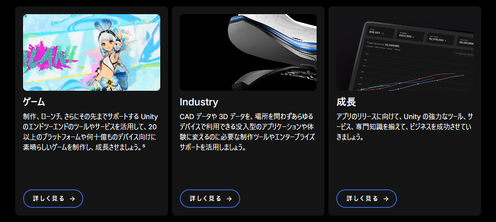

# Unity

## Unity とは？

Unity は、クロスプラットフォーム対応のゲームエンジンです。  
2D / 3D ゲームの開発に広く使われており、豊富な機能と使いやすいインターフェースが特徴です。

ゲーム制作以外にも、VR/AR アプリケーション開発やシミュレーションなど、様々な分野で利用されています。

### 主な機能

- ライティングやアニメーションの組み込み
- 物理演算エンジンの利用
- マルチプラットフォーム対応（PC / モバイル / VR / AR）
- シェーダー作成、エフェクト (particle / VFX) の追加
- サウンドの組み込み

### VRChat ワールド制作

VRC 用のワールド作成も Unity で行います。  
以前メタ創内で作成した VRC 用ワールドも Unity を使用して開発されています。

<iframe width="630"
        height="400" 
        src="https://www.youtube.com/embed/HHPRAg5ijXE?si=IU1PxKqYRhv2YtTh" 
        frameborder="0" allowfullscreen> 
</iframe>

### Unity のインストール方法

- https://youmanavisions.com/programming/post-16632/

## 学習リソース

### Unity 公式ドキュメント

- https://docs.unity.com/ja-jp

### Unity マニュアル 日本語版

- https://docs.unity3d.com/ja/current/Manual/UnityManual.html

### Unity Japan 公式 YouTube チャンネル

- https://www.youtube.com/@unity_japan/featured
