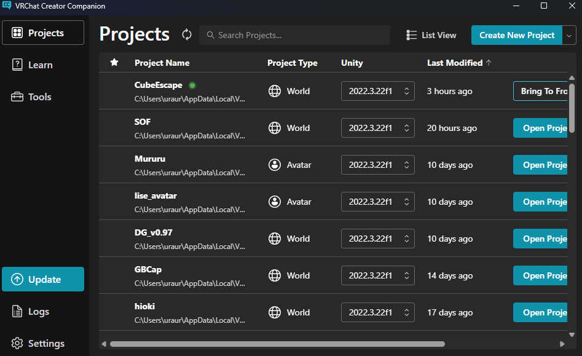

# VCC（VRChat Creator Companion）

## VCC とは？

**VCC（VRChat Creator Companion）** は、  
VRChat 用のアバターやワールドを制作・アップロードするための  
**公式サポートツール**です。

VRChat のコンテンツ制作では Unity を使用しますが、  
VCC を使うことで **VRChat 向けの Unity 環境を簡単・安全に構築**できます。

### VCC のインストール方法

- https://note.com/yurarara_23/n/n42f9a756cf2e

## VCC でできること

- VRChat に対応した **Unity バージョンの管理**
- **VRChat SDK のインストール・更新**
- アバター／ワールド用プロジェクトの作成
- 関連ツールの一元管理

## Unity バージョンの管理

Unity には多くのバージョンがありますが、  
**VRChat で使用できる Unity のバージョンは限定されています**。

また、VRChat の仕様変更により、  
対応 Unity バージョンが変更されることもあります。

VCC を使用すると

- VRChat 対応バージョンを自動で選択できる
- 推奨バージョンへの更新が簡単
- バージョン違いによるトラブルを防げる

といったメリットがあります。

## VRChat SDK の管理・配布

VRChat 用のコンテンツ制作には、  
**VRChat SDK** をはじめとする各種ツールが必要です。

VCC では

- VRChat SDK のインストール
- SDK のアップデート
- プロジェクトへの自動適用

を **ワンクリックで行うことができます**。

例えば、  
アバターやワールド用のプロジェクトを作成すると、  
対応する VRChat SDK が自動的にインストールされます。

## なぜ VCC が必須なのか

- 現在、**VRChat SDK の最新バージョンは VCC 経由でのみ配布**されています
- 手動で SDK を管理する必要がなくなり、作業ミスが激減します
- 初心者でも迷わず制作環境を構築できます

## 参考

### 公式ドキュメント

- https://vcc.docs.vrchat.com/
